# Webapp06: GlobalMart

## Desarrolladores

Este proyecto ha sido desarrollado por los siguientes colaboradores:

- **Luis Abril Andreu** - [l.abril.2022@alumnos.urjc.es](mailto:l.abril.2022@alumnos.urjc.es) - [GitHub](https://github.com/LuisAbril)
- **Cristian Teijeiro Parga** - [c.teijeiro.2022@alumnos.urjc.es](mailto:c.teijeiro.2022@alumnos.urjc.es) - [GitHub](https://github.com/teijeiro7)
- **Juan Manuel Bustos Moya** - [jm.bustos.2022@alumnos.urjc.es](mailto:jm.bustos.2022@alumnos.urjc.es) - [GitHub](https://github.com/juanmabm73)
- **Álvaro Pindado Castiñeira** - [a.pindado.2019@alumnos.urjc.es](mailto:a.pindado.2019@alumnos.urjc.es) - [GitHub](https://github.com/Alvaropin17)

## Tecnologías Usadas


## Preparación 1

#### Entidades

- **Usuario**: Tiene varios pedidos.
- **Pedidos**: Cada pedido puede tener varios o ningún producto.
- **Productos**: Cada producto puede tener cero o varias reseñas.
- **Reseñas**

#### Tipos de Usuarios

- **Anónimo**
- **Comprador (registrado)**
- **Empresa**
- **Administrador**

#### Permisos de los Usuarios

- **Anónimo** (usuario sin registrar):
  - No tiene permisos, solo puede ver productos, buscarlos, iniciar sesión y registrarse.
- **Comprador** (usuario registrado como individual):
  - Cerrar sesión, ver y buscar productos, añadir productos al carrito y realizar pedidos.
  - Subir reseñas de productos.
- **Empresa** (usuario registrado como empresa):
  - Subir productos con nombre, tipo, descripción, precio, cantidad e imagen.
  - Gestionar productos subidos (ver, editar, borrar).
  - Observar las gráficas que indiquen qué tipo de productos son los más subidos.
- **Administrador** (propietario de la app):
  - Gestionar solicitudes de productos de empresas (aceptar/rechazar).
  - Eliminar productos que no cumplan con el reglamento.
  - Editar información de productos.

### Imágenes

- **Anónimo**: Ninguna imagen asociada.
- **Comprador**: Imagen de perfil asociada a la cuenta.
- **Empresa**: Imagen de perfil asociada a la cuenta, además puede introducir imágenes para subir y editar productos.
- **Administrador**: Imagen de perfil asociada a la cuenta, además puede introducir imágenes para subir y editar productos.

### Gráficos

- **Gráfico para las empresas**
  - Gráfico circular en el que se muestra el porcentaje de tipos de productos que tiene una empresa subido y aceptado a la plataforma.
- **Gráfico para los usuarios**
  - Gráfico de líneas en el que se muestra el gasto del usuario a lo largo de la historia de la cuenta, en este gráfico aparece el gasto de cada pedido a lo largo del tiempo.

### Tecnología complementaria

- **Inicio de sesión con los servicios de google**

### Algoritmo de consulta avanzada

- Filtración por tipo y nombre del producto
- Productos más vistos
- Nuevos productos

#### Información de las Bases de Datos

1. **Usuarios**:
   - Tipo de usuario
   - Nombre de usuario
   - Contraseña
   - Carrito de compra
   - Historial de pedidos
2. **Productos**:
   - Tipo de producto:
     - Electronica
     - Libros
     - Educación
     - Electrodomesticos
     - Deporte
     - Música
     - Cine
     - Otros
   - Nombre de producto
   - Empresa
   - Precio
   - Descripción
   - Imagen
3. **Pedidos**:
   - Lista de productos
   - Precio total
   - Dirección de envío
   - ID del usuario
   - Método de pago
   - Instrucciones para el repartidor

## Preparación 2

### Pantallas

- **Pantalla de inicio de sesión/registro** - Esta pantalla permite a los usuarios iniciar sesión en la aplicación proporcionando sus credenciales.
  

- **Pantalla de perfil de usuario** - Esta pantalla muestra la información del perfil del usuario, incluyendo detalles personales y opciones de configuración.
  

- **Pantalla de lista de productos** - Esta pantalla muestra una lista de productos disponibles para la compra, con opciones de filtrado y búsqueda.
  

- **Pantalla de detalles del producto** - Esta pantalla muestra información detallada sobre un producto seleccionado, incluyendo imágenes, descripción y reseñas.
  

- **Pantalla de carrito de compras** - Esta pantalla muestra los productos que el usuario ha añadido a su carrito de compras, con opciones para modificar cantidades o eliminar productos.
  

- **Pantalla de estadísticas** - Esta pantalla muestra estadísticas relevantes para los usuarios y administradores, como gráficos de ventas, productos más vendidos, y análisis de usuarios.
  

- **Pantalla de solicitudes del administrador** - Esta pantalla permite al administrador ver y gestionar las solicitudes de productos subidos por las empresas, pudiendo aceptar o rechazar cada solicitud.
  .png>)

- **Pantalla de subida de un producto** - Esta pantalla es un formulario que permite a las empresas subir nuevos productos, incluyendo detalles como nombre, descripción, precio, y fotos.
  .png>)

- **Pantalla del usuario sin registrar** - Esta es la primera pantalla que aparece al cargar la web, mostrando productos destacados y opciones para iniciar sesión o registrarse.
  

- **Pantalla de productos de la empresa** - Esta pantalla muestra todos los productos que una empresa ha subido, permitiendo gestionar cada uno de ellos.
  

- **Diagrama de navegación**
  

## Práctica 1

#### Diagrama de Páginas GlobalMart

- **Navegador**

  - El navegador se muestra en todas las pantallas, permitiendo desde este realizar búsquedas de todos los productos, iniciar sesión, registrarse, crear nuevos productos, acceder a la información del perfil, acceder al carrito y a la sección de "About us".

- **Primera pantalla**

      - En esta captura se puede observar lo que el usuario observará nada más entrar a la web (desde aquí se puede observar los algoritmos de consulta implementados y toda la funcionalidad del navegador)

  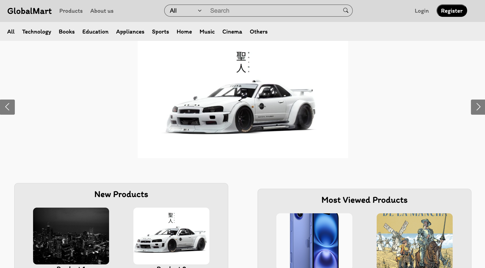

- **Pantalla de productos**

      - En esta captura se pueden observar los productos que han sido subidos por las compañías y aceptados por los administradores, esta pantalla la verás si eres un usuario sin iniciar sesión o un comprador.

  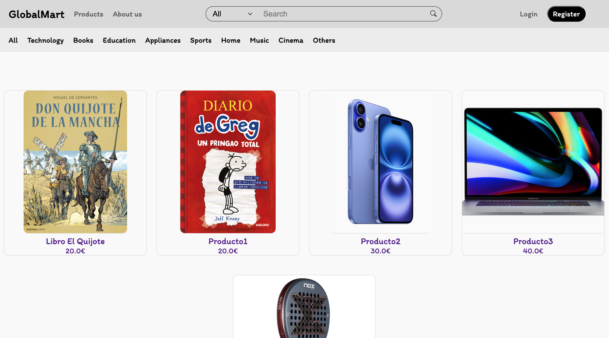

- **Pantalla About us**

      - En esta captura se puede observar información sobre nuestra empresa, en esta página nos introducimos a nosotros mismos indicando nuestras aficiones y lo que nos motiva a mejorar nuestra web.

  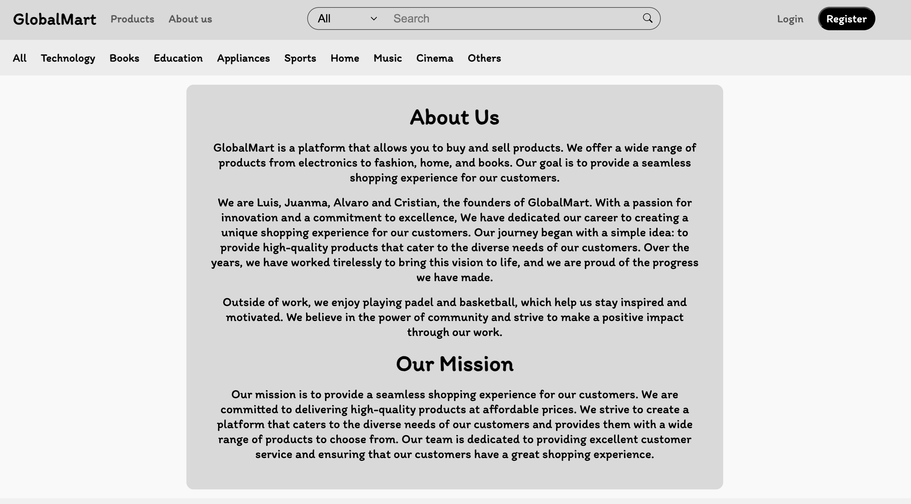

- **Pantalla de opciones para indentificarse**

      - Esta pantalla es un "pop-up" en el que solicita al usuario que se quiere identificar si desea utilizar un formulario en el que introducir su información para iniciar sesión / registrarse o si desea utilizar la tecnología complementaria de google para iniciar sesión con esta plataforma.

  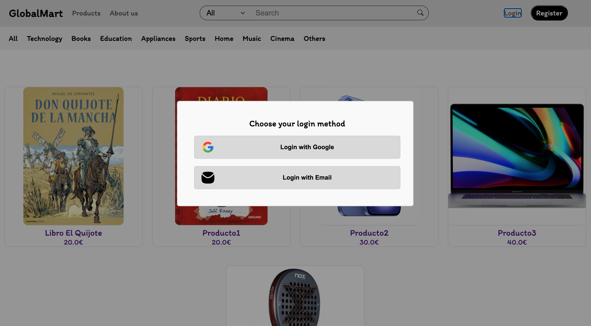

- **Pantalla de registro/inicio de sesión**

      - Esta pantalla es un "pop-up" en el que se solicita al usuario que se registre / inicie sesión mediante un formulario, además a través de este formulario el usuario podrá indicar si quiere una cuenta de compañía (para subir productos a la venta) o de comprador (para comprar los productos que suben las compañías).

  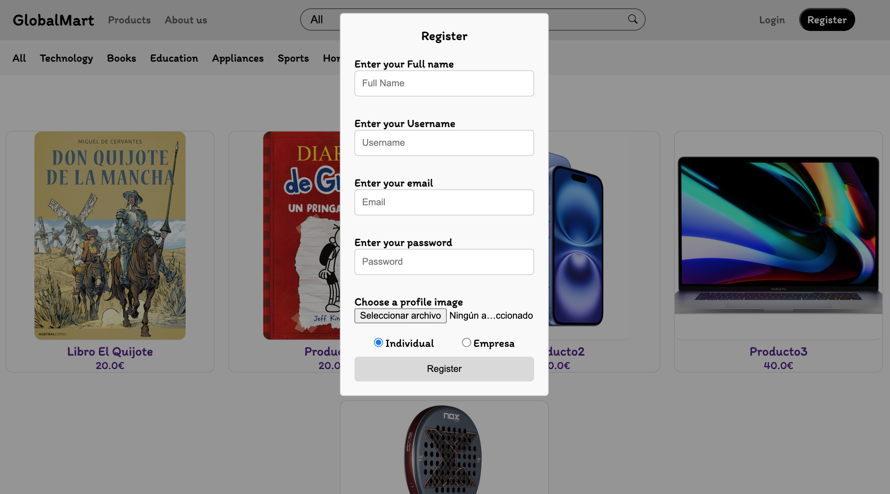

- **Pantalla de carrito**

      - En esta captura se puede observar el carrito del usuario que está registrado. Esta pantalla solo se puede observar si el usuario que ha iniciado sesión es un comprador.

  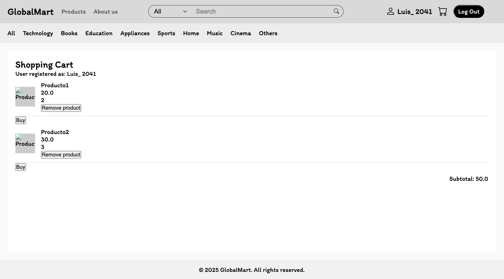

- **Pantalla de información de la cuenta**

      - En esta captura se puede observar la información de la cuenta que ha iniciado sesión.

  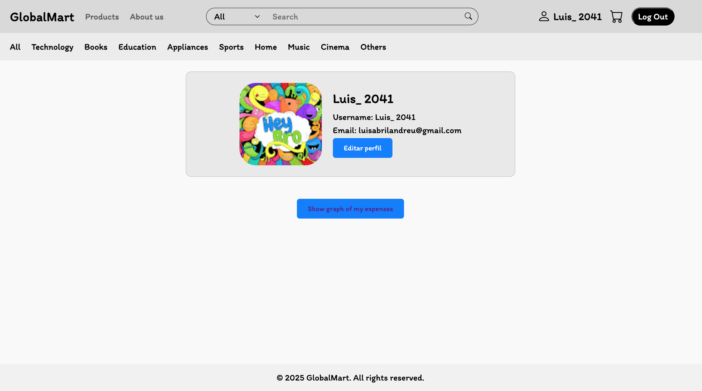

- **Pantalla de creación de nuevo producto**

      - En esta captura se puede observar un formulario que una compañía puede rellenar para la subida de un nuevo producto.

  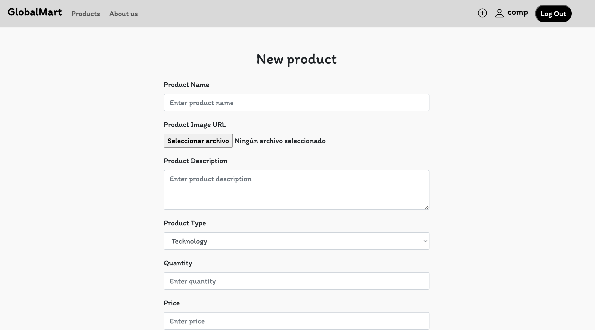

- **Pantalla de página de administrador**

      - En esta captura se observa la funcionalidad especial del administrador, la cual es aceptar o rechazar subidas de nuevos productos que quieres hacer las compañías.

  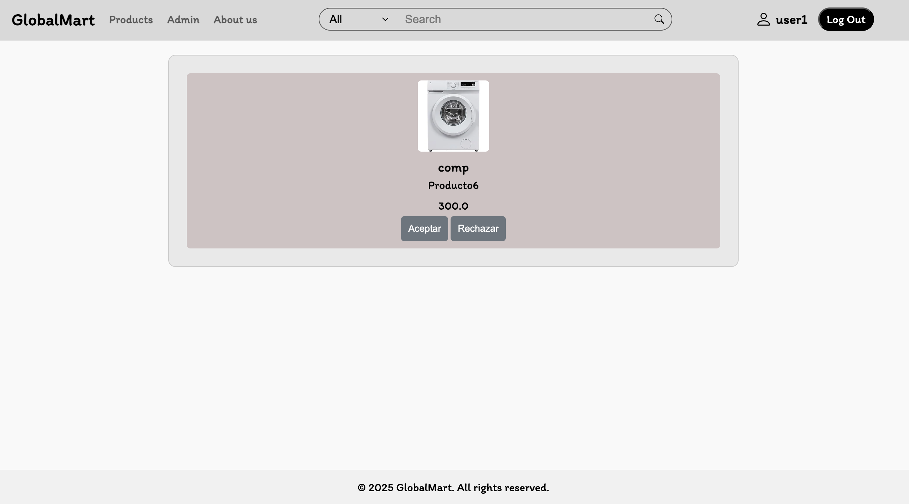

- **Pantalla de información detallada de un producto**

      - En esta captura se puede observar la información detallada de un producto, incluyendo las reviews de otros usuarios sobre ese mismo producto.

  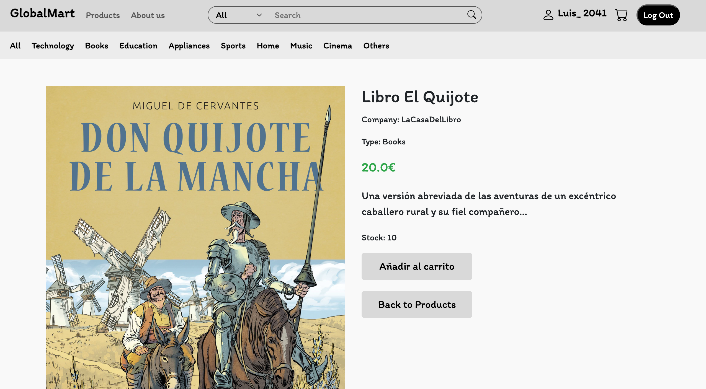
  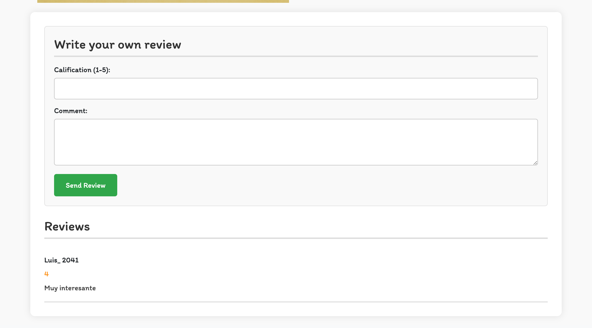

- **Diagrama de navegación de GlobalMart**
  

# Instrucciones de Ejecución

## Requisitos Previos

Antes de ejecutar la aplicación, asegúrate de tener instalados los siguientes componentes:

- **Java** (versión 21)
- **Apache Maven** (versión 3.8 o superior)
- **MySQL Server** (versión 8.0 o superior)
- **Git**

---

## Clonar el repositorio

- Ejecuta el siguiente comando en la terminal para descargar el código fuente:

git clone https://github.com/CodeURJC-DAW-2024-25/webapp06
cd webapp06

---

## MYSQL

- Iniciar Sesión:

mysql -u root -p 1234password?

- Crear la base de datos:

CREATE DATABASE global_mart;

- Salir de MYSQL:

EXIT;

---

## Construir y Ejecutar la aplicación

- Construir la aplicación:

mvn clean package

- Ejecutar la aplicación:

java -jar target/webapp6.jar

---

## Acceder a la aplicación

Acceder en el navegador a la url: https://localhost:8443

---

## Usuarios de la aplicación

- **Administrador**:
  - **username**: user1
  - **password**: user1
- **Compañía**:
  - **username**: comp
  - **password**: comp
- **Usuario registrado**:
  - **username**: a
  - **password**: a

---

**Diagrama de relaciones de base de datos**
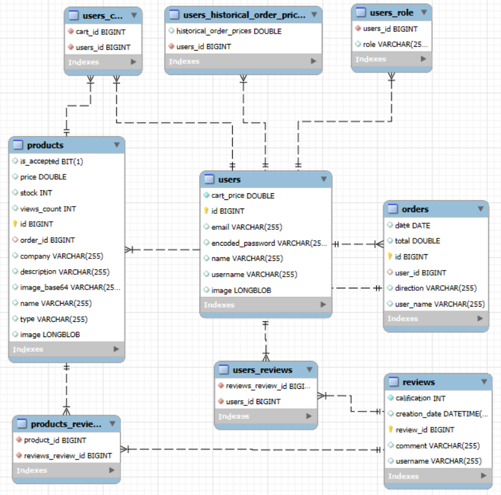
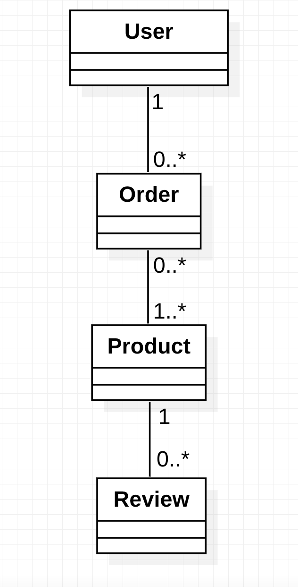

**Diagrama de relaciones de clases**
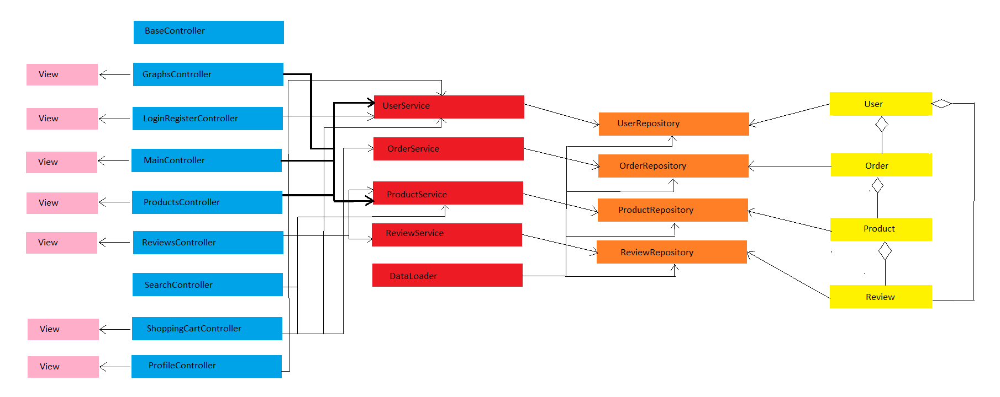

## Commits de Mayor Importancia Realizados

### Luis

| **Descripción**                                                                                                                                                                                                                                                                      | **Link**                                                                                                               |
| ------------------------------------------------------------------------------------------------------------------------------------------------------------------------------------------------------------------------------------------------------------------------------------ | ---------------------------------------------------------------------------------------------------------------------- |
| Commit en el que se ha aplicado la funcionalidad de AJAX (se ha ido retocando con commits anteriores y futuros)                                                                                                                                                                      | [Link Commit 1 Luis](https://github.com/CodeURJC-DAW-2024-25/webapp06/commit/9dedd81c14dd7eb4c7079a6522eba629c617b91a) |
| Commit en el que se ha implementado la posibilidad de registro desde una cuenta de la plataforma google                                                                                                                                                                              | [Link Commit 2 Luis](https://github.com/CodeURJC-DAW-2024-25/webapp06/commit/a021b735c768df52e518ebf91d18ed09d6e862c1) |
| Commit en el que se ha implementado la correcta visualización de los productos                                                                                                                                                                                                       | [Link Commit 3 Luis](https://github.com/CodeURJC-DAW-2024-25/webapp06/commit/2edc130217277e00bf35a17891e70f803e52db5f) |
| Commit en el que se ha implementado la funcionalidad de la página de los administradores                                                                                                                                                                                             | [Link 4](https://github.com/CodeURJC-DAW-2024-25/webapp06/commit/02ef00424dc21eea547535221e942d6938a24b75)             |
| Commit en el que se utiliza mustache para la correcta renderización de los elementos en el html aplicando los respectivos roles de cada usuario, además se mejora la carga de los productos permitiendo la carga de los productos propios de la compañía (en caso de iniciar sesión) | [Link 5](https://github.com/CodeURJC-DAW-2024-25/webapp06/commit/8120cc28516db47317e622c0c449b109e82f34d2)             |

### Cristian

| **Descripción**                                         | **Link**                                                                                                   |
| ------------------------------------------------------- | ---------------------------------------------------------------------------------------------------------- |
| Clase, Repo y Servicio User                             | [Link 1](https://github.com/CodeURJC-DAW-2024-25/webapp06/commit/67cd541161ceefb0da09bb75f7fe6860e179f993) |
| Search Controller y arreglo Data Loader                 | [Link 2](https://github.com/CodeURJC-DAW-2024-25/webapp06/commit/8a7bff3ab42c6e1ad0f133f6599429a70872b951) |
| Empiezo login (hecho mas tarde, pero no en este commit) | [Link 3](https://github.com/CodeURJC-DAW-2024-25/webapp06/commit/8a7bff3ab42c6e1ad0f133f6599429a70872b951) |
| Editar perfil                                           | [Link 4](https://github.com/CodeURJC-DAW-2024-25/webapp06/commit/79db84e9a3ffdb4450fafa1ac5381440b0ff75ad) |
| Búsqueda de productos                                   | [Link 5](https://github.com/CodeURJC-DAW-2024-25/webapp06/commit/78f789f5ff74787465a3078d72c65e6648173b72) |

### Juan Manuel

| **Descripción**                                                                                                                    | **Link**                                                                                                   |
| ---------------------------------------------------------------------------------------------------------------------------------- | ---------------------------------------------------------------------------------------------------------- |
| Company graph, commit where it was implemented a pie chart of the types of products in a company                                   | [Link 1](https://github.com/CodeURJC-DAW-2024-25/webapp06/commit/23fdae3d2fb9dca53df17ab606dc2cdc9ff8ecff) |
| User graph, similar to the company graph but with a different chary to show the historical prices trend of orders (not definitive) | [Link 2](https://github.com/CodeURJC-DAW-2024-25/webapp06/commit/3e1798d5773b7716f5c88de4eca018a7c8aef102) |
| Cart changes, remodeling the initial cart, with "add product to cart" funcionality (not definitive improvements in next commits)   | [Link 3](https://github.com/CodeURJC-DAW-2024-25/webapp06/commit/514d2a2fe2159ff4f4a4db08a46253cb03ae4eeb) |
| Remove product and initiate payment in cart, includes remove funcionality and the initial step of payment method too               | [Link 4](https://github.com/CodeURJC-DAW-2024-25/webapp06/commit/041da04d4e0eb9e3e506f860f39efa024d0494d8) |
| Payment and others corrections, includes final payment funcionality and other changes in models                                    | [Link 5](https://github.com/CodeURJC-DAW-2024-25/webapp06/commit/46d2147ac3a20fede704f03a30233d5689d5d43e) |

### Álvaro

| **Descripción**                                | **Link**                                                                                                   |
| ---------------------------------------------- | ---------------------------------------------------------------------------------------------------------- |
| Implementation of review system                | [Link 1](https://github.com/CodeURJC-DAW-2024-25/webapp06/commit/20c9ec1387fb75e03de355ef533e6ce1c83c0f45) |
| Review first implementation                    | [Link 2](https://github.com/CodeURJC-DAW-2024-25/webapp06/commit/dbe2994feb2bcc456fe9c7e67c7b10044574bb2d) |
| More review and product service optimization   | [Link 3](https://github.com/CodeURJC-DAW-2024-25/webapp06/commit/20c9ec1387fb75e03de355ef533e6ce1c83c0f45) |
| Ayax first iteration                           | [Link 4](https://github.com/CodeURJC-DAW-2024-25/webapp06/commit/c7a6f8454ad6801728c52c7af6b3ddc629b044d5) |
| Optimization of product service and repository | [Link 5](https://github.com/CodeURJC-DAW-2024-25/webapp06/commit/ea9c698e8757195f78743e3fa3df575ea6f711ad) |

## Ficheros de Mayor Participación

### Luis

| **Descripción**         | **Link**                                                                                                                                              |
| ----------------------- | ----------------------------------------------------------------------------------------------------------------------------------------------------- |
| MainController.java     | [Link 1](https://github.com/CodeURJC-DAW-2024-25/webapp06/blob/main/webapp6/src/main/java/es/codeurjc/global_mart/controller/MainController.java)     |
| BaseController.java     | [Link 2](https://github.com/CodeURJC-DAW-2024-25/webapp06/blame/main/webapp6/src/main/java/es/codeurjc/global_mart/controller/BaseController.java)    |
| LoadMore.js             | [Link 3](https://github.com/CodeURJC-DAW-2024-25/webapp06/blob/main/webapp6/src/main/resources/static/js/loadMoreTypes.js)                            |
| Products.html           | [Link 4](https://github.com/CodeURJC-DAW-2024-25/webapp06/blob/main/webapp6/src/main/resources/templates/products.html)                               |
| ProductsController.html | [Link 5](https://github.com/CodeURJC-DAW-2024-25/webapp06/blob/main/webapp6/src/main/java/es/codeurjc/global_mart/controller/ProductsController.java) |

### Cristian

| **Descripción**         | **Link**                                                                                                                                                   |
| ----------------------- | ---------------------------------------------------------------------------------------------------------------------------------------------------------- |
| UserService.java        | [Link 1](https://github.com/CodeURJC-DAW-2024-25/webapp06/blob/main/webapp6/src/main/java/es/codeurjc/global_mart/service/UserService.java)                |
| LoginRegisterController | [Link 2](https://github.com/CodeURJC-DAW-2024-25/webapp06/blob/main/webapp6/src/main/java/es/codeurjc/global_mart/controller/LoginRegisterController.java) |
| SearchController.java   | [Link 3](https://github.com/CodeURJC-DAW-2024-25/webapp06/blob/main/webapp6/src/main/java/es/codeurjc/global_mart/controller/SearchController.java)        |
| User.java               | [Link 4](https://github.com/CodeURJC-DAW-2024-25/webapp06/blob/main/webapp6/src/main/java/es/codeurjc/global_mart/model/User.java)                         |
| login.js                | [Link 5](https://github.com/CodeURJC-DAW-2024-25/webapp06/blob/main/webapp6/src/main/resources/static/js/login.js)                                         |

### Juan Manuel

| **Descripción**                      | **Link**                                                                                                                                                  |
| ------------------------------------ | --------------------------------------------------------------------------------------------------------------------------------------------------------- |
| ShoppingCartController.java          | [Link 1](https://github.com/CodeURJC-DAW-2024-25/webapp06/blob/main/webapp6/src/main/java/es/codeurjc/global_mart/controller/ShoppingCartController.java) |
| GraphsController.java                | [Link 2](https://github.com/CodeURJC-DAW-2024-25/webapp06/blob/main/webapp6/src/main/java/es/codeurjc/global_mart/controller/GraphsController.java)       |
| Order.java                           | [Link 3](https://github.com/CodeURJC-DAW-2024-25/webapp06/blob/main/webapp6/src/main/java/es/codeurjc/global_mart/model/Order.java)                       |
| companyGraph.html and userGraph.html | [Link 4](https://github.com/CodeURJC-DAW-2024-25/webapp06/blob/main/webapp6/src/main/resources/templates/companyGraphs.html)                              |
| shoppingCart.html                    | [Link 5](https://github.com/CodeURJC-DAW-2024-25/webapp06/blob/main/webapp6/src/main/resources/templates/shoppingcart.html)                               |

### Álvaro

| **Descripción**         | **Link**                                                                                                                                              |
| ----------------------- | ----------------------------------------------------------------------------------------------------------------------------------------------------- |
| ProductService.java     | [Link 1](https://github.com/CodeURJC-DAW-2024-25/webapp06/blob/main/webapp6/src/main/java/es/codeurjc/global_mart/service/ProductService.java)        |
| reviews.html            | [Link 2](https://github.com/CodeURJC-DAW-2024-25/webapp06/blob/main/webapp6/src/main/resources/templates/components/reviews.html)                     |
| ProductsController.java | [Link 3](https://github.com/CodeURJC-DAW-2024-25/webapp06/blob/main/webapp6/src/main/java/es/codeurjc/global_mart/controller/ProductsController.java) |
| DataLoader.java         | [Link 4](https://github.com/CodeURJC-DAW-2024-25/webapp06/blob/main/webapp6/src/main/java/es/codeurjc/global_mart/config/DataLoader.java)             |
| Review.java             | [Link 5](https://github.com/CodeURJC-DAW-2024-25/webapp06/blob/main/webapp6/src/main/java/es/codeurjc/global_mart/model/Review.java)                  |

---

## Práctica 2

### Documentación de la API Rest

### Actualización de diagrama de clases

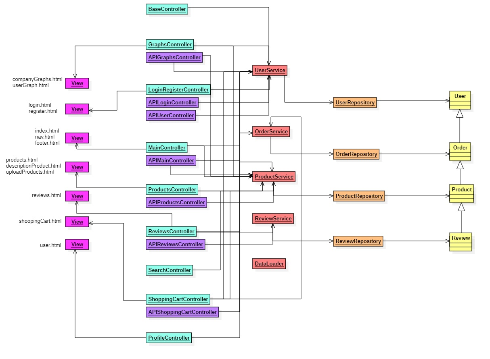

### Instrucciones de ejecución de la aplicación dockerizada

- #### Requisitos previos:

  Para poder descargar y ejecutar la aplicación dockerizada tan sólo es necesario:

  - [Docker](https://www.docker.com/products/docker-desktop)

- #### Pasos para la instalación:

1. Descarga la imagen de la aplicación desde el repositorio de Docker Hub:
   ```
   sudo docker pull alvaro3517/webapp6
   ```
2. Ubica tu terminal en la carpeta donde tengas el archivo [docker-compose.yml].
   ```
   cd webapp06
   ```
3. Ejecuta el archivo docker-compose.yml:
   ```
   docker-compose up
   ```
4. Una vez haya terminado de ejecutarse, abre en tu navegador de preferencia dicha [dirección](https://localhost:443).

## 📦 Creación de imagen de la aplicación

Para poder crear a imagen de la aplicación es necesario tener docker instalado en tu máquina. Una vez tengas docker instalado, sigue los siguientes pasos:

1. Clona el repositorio a tu ruta deseada:
   ```
    git clone https://github.com/CodeURJC-DAW-2023-24/webapp06
   ```
2. Inicia sesión en tu cuenta de Docker Hub. Si no tienes una, puedes crearla [aquí](https://hub.docker.com/signup). Se te pedirá introducir tu usuario y contraseña:
   ```
   docker login
   ```
3. Ejecuta el ejecutable bash script que creará la imagen de la aplicación:

   ```
   ./docker_image.sh
   ```

   Ten en cuenta que este script crea la imagen con el nombre "alvaro3517/webapp6" y la subirá a tu cuenta de Docker Hub. Si deseas cambiar el nombre de la imagen o el nombre de usuario, puedes hacerlo modificando el script, pero deberás también cambiar el nombre de la imagen que se usa en el docker compose yml.

## 🛫 Despliegue de la aplicación en una máquina virtual

### Pasos previos

1. Descargar la clave proporcionada a través de correo electrónico por parte de los docentes.
2. Conectarse a la red de la Universidad a través del Escritorio de Desarrollo.

### Pasos para el despliegue

1. Conectarse a la máquina virtual:

   ```
   ssh -i appWeb06.key vmuser@appWeb06.dawgis.etsii.urjc.es
   ```

2. Instalar Docker con Docker Compose en la máquina virtual:

   ```
   sudo docker install
   ```

3. Clonar el repositorio en la máquina virtual:
   ```
   git clone https://github.com/CodeURJC-DAW-2024-25/webapp06.git
   ```
4. En la carpeta raíz del repositorio, donde se encuentra el fichero docker-compose.yml, ejecutar el siguiente comando para iniciar la aplicación:

   ```
   sudo ./docker_script.sh
   ```

   Si antes no creaste la imagen, deberás ejecutar antes:

   ```
   sudo ./docker_image.sh
   ```

5. Una vez haya terminado de arrancar, conectarse a:
   ```
   https://appWeb06.dawgis.etsii.urjc.es:443
   ```

### Detener la aplicación

Una vez inicializada la aplicación, para detenerla se puede hacer con:
`sudo docker compose stop`

### Volver a arrancar la aplicación

Una vez ya ha sido detenida, se puede volver a arrancar con:
`sudo ./docker_script.sh`

### Documentación de la API

[YAML](https://github.com/CodeURJC-DAW-2024-25/webapp06/blob/50e1321842da4f697e16d371877d4bcfc1d21cc3/backend/api-docs/api-docs.yaml)
[APIDOCS](https://raw.githack.com/CodeURJC-DAW-2024-25/webapp06/main/backend/api-docs/api-docs.html)

### Participación de miembros

#### Cristian

##### Descripción textual

Mi labor en esta práctica ha constado de la revisión y el análisis de errores al transformar la aplicación, ya que al transformar las clases en diferentes DTOs, nos ha llevado a cabo varios errores que hemos tenido que solucionar. Además de revisar y analizar errores, he llevado a cabo la adaptación del código a los DTOs. También me he encargado de gestionar la documentación tanto el README como la documentación de la API. He realizado además la actualización del diagrama de clases.

##### Listados 5 commits más significativos

| **Descripción commit**                                               | **Link**                                                                                                 |
| -------------------------------------------------------------------- | -------------------------------------------------------------------------------------------------------- |
| Convertir todas las clases en diferentes DTOs según la funcionalidad | [Link](https://github.com/CodeURJC-DAW-2024-25/webapp06/commit/e1c0329c6bdc0a08bf68d48f2c2dda2185a20fcf) |
| Añadir SearchProductDTO y actualizar ProductMapper                   | [Link](https://github.com/CodeURJC-DAW-2024-25/webapp06/commit/9dd794480171cf4ea9d616bec6276270b5e756d0) |
| Arreglar AJAX                                                        | [Link](https://github.com/CodeURJC-DAW-2024-25/webapp06/commit/5358de8d570dfcdca63331ac51066718820975e2) |
| Arreglar Imágenes                                                    | [Link](https://github.com/CodeURJC-DAW-2024-25/webapp06/commit/cdefad72f77d024038bc4f0745f66539c10a7926) |
| Arreglar Reviews                                                     | [Link](https://github.com/CodeURJC-DAW-2024-25/webapp06/commit/33e65c4383c2e70d8093305beaa81e87fbeee561) |

##### Listado 5 ficheros con mayor participación

| **Fichero**             | **Link**                                                                                                                                            |
| ----------------------- | --------------------------------------------------------------------------------------------------------------------------------------------------- |
| ReviewsController.java  | [Link](https://github.com/CodeURJC-DAW-2024-25/webapp06/blob/main/webapp6/src/main/java/es/codeurjc/global_mart/controller/ReviewsController.java)  |
| ProductsController.java | [Link](https://github.com/CodeURJC-DAW-2024-25/webapp06/blob/main/webapp6/src/main/java/es/codeurjc/global_mart/controller/ProductsController.java) |
| MainController.java     | [Link](https://github.com/CodeURJC-DAW-2024-25/webapp06/blob/main/webapp6/src/main/java/es/codeurjc/global_mart/controller/MainController.java)     |
| SearchController.java   | [Link](https://github.com/CodeURJC-DAW-2024-25/webapp06/blob/main/webapp6/src/main/java/es/codeurjc/global_mart/controller/SearchController.java)   |
| ProductService.java     | [Link](https://github.com/CodeURJC-DAW-2024-25/webapp06/blob/main/webapp6/src/main/java/es/codeurjc/global_mart/service/ProductService.java)        |

---

#### Juan Manuel

##### Descripción textual

##### Listados 5 commits más significativos

| **Descripción commit**                            | **Link**                                                                                                   |
| ------------------------------------------------- | ---------------------------------------------------------------------------------------------------------- |
| DTO structure                                     | [Link 1](https://github.com/CodeURJC-DAW-2024-25/webapp06/commit/ed0d1e4626311530cd2be13c3f2add41cc4d64c2) |
| Adapt controllers to dto                          | [Link 2](https://github.com/CodeURJC-DAW-2024-25/webapp06/commit/6788820862726d7524c33ae1da125ba51a601db3) |
| Modifies DTOs services, mappers etc               | [Link 3](https://github.com/CodeURJC-DAW-2024-25/webapp06/commit/e9d43254e53c451d6671206729f1275fa2283517) |
| Api Graphs Controller                             | [Link 4](https://github.com/CodeURJC-DAW-2024-25/webapp06/commit/1984f87a04c2b0dbd005815c08a734de9e0411b1) |
| Shopping cart DTO, review mapper, controllers etc | [Link 5](https://github.com/CodeURJC-DAW-2024-25/webapp06/commit/6788820862726d7524c33ae1da125ba51a601db3) |

##### Listado 5 ficheros con mayor participación

| **Fichero**             | **Link** |
| ----------------------- | -------- |
| ApiGraphController.java |          |
| ShoppingCartController  |          |
| DTOs                    |          |
| Services                |          |
| Controllers             |          |

---

#### Álvaro

##### Descripción textual

##### Listados 5 commits más significativos

| **Descripción commit**                   | **Link**                                                                                                   |
| ---------------------------------------- | ---------------------------------------------------------------------------------------------------------- |
| Added more functionality to the UsersAPI | [Link 1](https://github.com/CodeURJC-DAW-2024-25/webapp06/commit/b5f91b3a9c47ef11e560da9307431e69abb25e20) |
| Added more functionality to all the APIs | [Link 1](https://github.com/CodeURJC-DAW-2024-25/webapp06/commit/f7201c42d751b9b0967fe1a7420d06b70a803abc) |
| Added more functionality to the UserAPI  | [Link 1](https://github.com/CodeURJC-DAW-2024-25/webapp06/commit/cc902771be17def3df4a7cdd91a907de5e99bf11) |
| DockerCompose WIP                        | [Link 1](https://github.com/CodeURJC-DAW-2024-25/webapp06/commit/46dee72aae10deaa47f800d13f12f7ab04675b57) |
| Last docker fix                          | [Link 1](https://github.com/CodeURJC-DAW-2024-25/webapp06/commit/3f5e9b45933b95f9c3005554b393d0bd62b26904) |

##### Listado 5 ficheros con mayor participación

| **Fichero**          | **Link**                                                                                                                                                         |
| -------------------- | ---------------------------------------------------------------------------------------------------------------------------------------------------------------- |
| Dockerfile           | [Link 1](https://github.com/CodeURJC-DAW-2024-25/webapp06/blob/main/Dockerfile)                                                                                  |
| Docker-compose       | [Link 1](https://github.com/CodeURJC-DAW-2024-25/webapp06/blob/main/docker-compose.yml)                                                                          |
| APIProductController | [Link 1](https://github.com/CodeURJC-DAW-2024-25/webapp06/blob/main/webapp6/src/main/java/es/codeurjc/global_mart/controller/API_Rest/APIProductController.java) |
| APIUserController    | [Link 1](https://github.com/CodeURJC-DAW-2024-25/webapp06/blob/main/webapp6/src/main/java/es/codeurjc/global_mart/controller/API_Rest/APIUserController.java)    |
| APIReviewsController | [Link 1](https://github.com/CodeURJC-DAW-2024-25/webapp06/blob/main/webapp6/src/main/java/es/codeurjc/global_mart/controller/API_Rest/APIReviewsController.java) |

---

#### Luis

##### Descripción textual

Mi labor en esta práctica ha sido la colaboración a la hora de realizar la API y la configuración de de la seguridad de la API

##### Listados 5 commits más significativos

| **Descripción commit**          | **Link**                                                                                                  |
| ------------------------------- | --------------------------------------------------------------------------------------------------------- |
| Security Almost Finished        | [Link1](https://github.com/CodeURJC-DAW-2024-25/webapp06/commit/0496ac0df8a7297778953d9aa390278cd1a74ea8) |
| Images Product Progress         | [Link2](https://github.com/CodeURJC-DAW-2024-25/webapp06/commit/c4f0adc694323f424229d62867ca68a1e6ebe3ae) |
| API Main Controller             | [Link3](https://github.com/CodeURJC-DAW-2024-25/webapp06/commit/e7e94b30c6801ed424a7c3e9c0a86b55346fa9f4) |
| Postman tools and functionality | [Link4](https://github.com/CodeURJC-DAW-2024-25/webapp06/commit/0f261eb3e234062a27b4c93b6c8c2464cc3c3d5e) |
| API Product Controller          | [Link5](https://github.com/CodeURJC-DAW-2024-25/webapp06/commit/2153f48cf89f2a91af04d5f217942577eb22855a) |

##### Listado 5 ficheros con mayor participación

| **Fichero**                   | **Link**                                                                                                                                                         |
| ----------------------------- | ---------------------------------------------------------------------------------------------------------------------------------------------------------------- |
| APIMainController.java        | [Link1](https://github.com/CodeURJC-DAW-2024-25/webapp06/blame/main/webapp6/src/main/java/es/codeurjc/global_mart/controller/API_Rest/APIMainController.java)    |
| APIProductsController.java    | [Link2](https://github.com/CodeURJC-DAW-2024-25/webapp06/blame/main/webapp6/src/main/java/es/codeurjc/global_mart/controller/API_Rest/APIProductController.java) |
| GlobalMartSecurityConfig.java | [Link3](https://github.com/CodeURJC-DAW-2024-25/webapp06/blob/main/webapp6/src/main/java/es/codeurjc/global_mart/security/GlobalMartSecurityConfig.java)         |
| ProductService.java           | [Link4](https://github.com/CodeURJC-DAW-2024-25/webapp06/blob/main/webapp6/src/main/java/es/codeurjc/global_mart/service/ProductService.java)                    |
| APIReviewsController.java     | [Link5](https://github.com/CodeURJC-DAW-2024-25/webapp06/blame/main/webapp6/src/main/java/es/codeurjc/global_mart/controller/API_Rest/APIReviewsController.java) |


---

## Práctica 3

### Diagrama de componentes
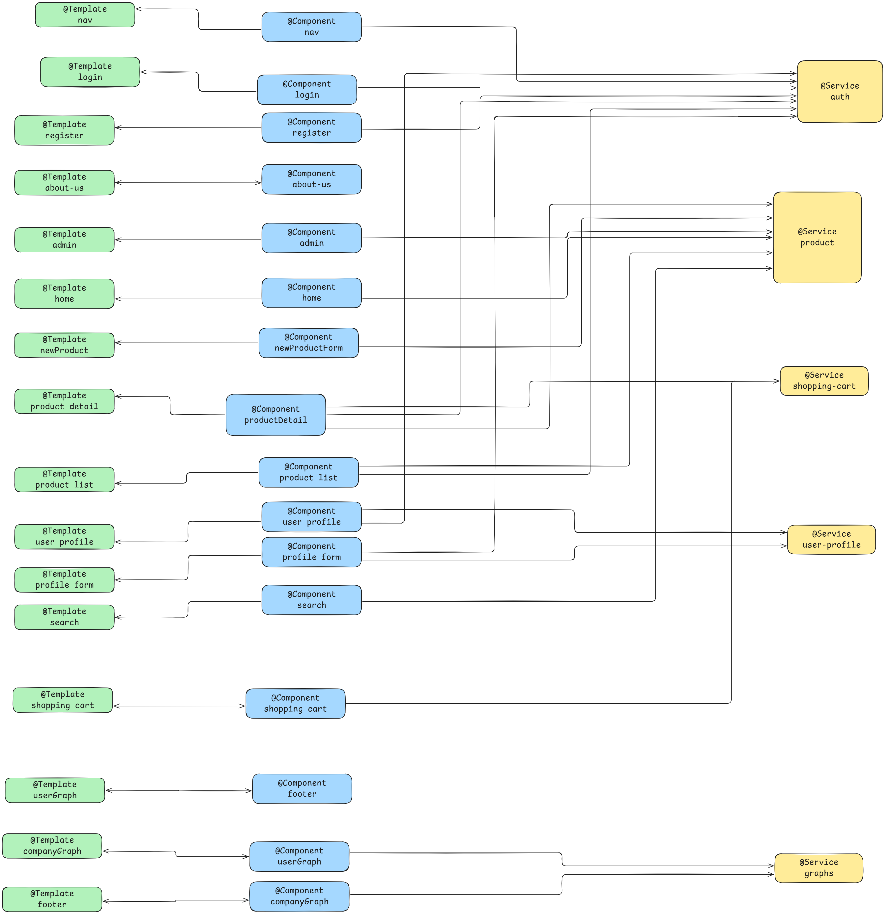

### Instrucciones de ejecución

Asegurarse de que Node.js está instalado  
Abrir una terminal y ejecutar los siguientes comandos:
```
npm install
```
```
cd frontend
```
```
ng serve --proxy-config proxy.conf.json
```

Después ejecutar la base de datos y la aplicación springboot (fase 1)

### Video de youtube

[Link_al_enlace_de_youtube](https://youtu.be/eJL97nKrpsA)


### Commits y archivos más significativos

#### Cristian

##### Listados 5 commits más significativos

| **Descripción commit**              | **Link**                                                                                                 |
| ----------------------------------- | -------------------------------------------------------------------------------------------------------- |
| Shopping Cart done                  | [Link](https://github.com/CodeURJC-DAW-2024-25/webapp06/commit/3bfa40c877f9a5fe08732ec3d459595dde818ed9) |
| Connect API Rest to Angular Project | [Link](https://github.com/CodeURJC-DAW-2024-25/webapp06/commit/af2ec37cd197c8d6bb397b4fedc79091e2effdde) |
| Login finally done                  | [Link](https://github.com/CodeURJC-DAW-2024-25/webapp06/commit/e864c24eecd6e80df920161684bcbb3c82586631) |
| Product management                  | [Link](https://github.com/CodeURJC-DAW-2024-25/webapp06/commit/50eded6c3dfaf24e4f308cc35603dd480b48537e) |
| Angular views                       | [Link](https://github.com/CodeURJC-DAW-2024-25/webapp06/commit/cb84897ca6eb8f17aa5c089f46babf1b05d4e479) |

##### Listado 5 ficheros con mayor participación

| **Fichero**              | **Link**                                                                                                                |
| ------------------------ | ----------------------------------------------------------------------------------------------------------------------- |
| Views                    | [Link](https://github.com/CodeURJC-DAW-2024-25/webapp06/tree/main/frontend/src/app/components)                          |
| shopping-cart.service.ts | [Link](https://github.com/CodeURJC-DAW-2024-25/webapp06/blob/main/frontend/src/app/service/shopping-cart.service.ts)    |
| auth.service.ts          | [Link](https://github.com/CodeURJC-DAW-2024-25/webapp06/blob/main/frontend/src/app/service/auth/auth.service.ts)        |
| login.component.ts       | [Link](https://github.com/CodeURJC-DAW-2024-25/webapp06/blob/main/frontend/src/app/components/login/login.component.ts) |
| ProductList Folder       | [Link](https://github.com/CodeURJC-DAW-2024-25/webapp06/tree/main/frontend/src/app/components/product-list)             |


#### Luis Abril

##### Listados 5 commits más significativos

| **Descripción commit**              | **Link**                                                                                                 |
| ----------------------------------- | -------------------------------------------------------------------------------------------------------- |
| New product and edit product component done                  | [Link](https://github.com/CodeURJC-DAW-2024-25/webapp06/commit/71654ca20576a017086ad7d537a9a9c587d593b0) |
| Admin functionality| [Link](https://github.com/CodeURJC-DAW-2024-25/webapp06/commit/bec1832b56d43fdf7fbc32fd6039d115dd7748cf ) |
| Problems with the roles fixed and the load of user images                  | [Link](https://github.com/CodeURJC-DAW-2024-25/webapp06/commit/71130f089462bfdc54da68e4706213af72999f71) |
| All review part done                 | [Link](https://github.com/CodeURJC-DAW-2024-25/webapp06/commit/aa4cd180de6b358e9b544fdf6cceb56c44872e60  ) |
| MostViewedProducts algorithm done                      | [Link](https://github.com/CodeURJC-DAW-2024-25/webapp06/commit/120fdca54cde6c23f6704c77ea5bd61c665ab3a8 ) |

##### Listado 5 ficheros con mayor participación

| **Fichero**              | **Link**                                                                                                                |
| ------------------------ | ----------------------------------------------------------------------------------------------------------------------- |
| form.component.ts                    | [Link](https://github.com/CodeURJC-DAW-2024-25/webapp06/blob/main/frontend/src/app/components/newProdFrom/form.component.ts)                          |
| admin.component.ts | [Link](https://github.com/CodeURJC-DAW-2024-25/webapp06/blob/main/frontend/src/app/components/admin/admin.component.ts)    |
| product-detail.component.ts          | [Link](https://github.com/CodeURJC-DAW-2024-25/webapp06/blob/main/frontend/src/app/components/product-detail/product-detail.component.ts)        |
| product.service.ts       | [Link](https://github.com/CodeURJC-DAW-2024-25/webapp06/blob/main/frontend/src/app/service/product.service.ts) |
| register.component.ts       | [Link](https://github.com/CodeURJC-DAW-2024-25/webapp06/blob/main/frontend/src/app/components/register/register.component.ts)             |

#### Juan Manuel Bustos

##### Listados 5 commits más significativos

| **Descripción commit**              | **Link**                                                                                                 |
| ----------------------------------- | -------------------------------------------------------------------------------------------------------- |
| Graphs components | [Link](https://github.com/CodeURJC-DAW-2024-25/webapp06/commit/3b88f16bf444d1c4a2d9d54eea66ae392f9eedce) | 
| Add CompanyGraph component and update routing in user profile | [Link](https://github.com/CodeURJC-DAW-2024-25/webapp06/commit/0a15a2491904864bf4447ac465a12d3272f6ea19) |
| Edit Profile  | [Link](https://github.com/CodeURJC-DAW-2024-25/webapp06/commit/72f928948028cf53a1dcc0176793eda1f693ddd6) |
| Home Component | [Link](https://github.com/CodeURJC-DAW-2024-25/webapp06/commit/1950bc9043dff7a586594e9b0d64c3ce810ac9ad ) |
| User Profile | [Link]( https://github.com/CodeURJC-DAW-2024-25/webapp06/commit/68dfbee4ffde9924febf84eed4c0fbf9190b37a6) |

##### Listado 5 ficheros con mayor participación

| **Fichero**              | **Link**                                                                                                                |
| ------------------------ | ----------------------------------------------------------------------------------------------------------------------- |
| CompanyGrap Folder  | [Link](https://github.com/CodeURJC-DAW-2024-25/webapp06/tree/main/frontend/src/app/components/company-graph)                          |
| Home Folder | [Link](https://github.com/CodeURJC-DAW-2024-25/webapp06/tree/main/frontend/src/app/components/home)    |
| User graph Folder       | [Link](https://github.com/CodeURJC-DAW-2024-25/webapp06/tree/main/frontend/src/app/components/user-graph)        |
| User Profile Folder  | [Link](https://github.com/CodeURJC-DAW-2024-25/webapp06/tree/main/frontend/src/app/components/user-profile) |
| Graphs  | [Link](https://github.com/CodeURJC-DAW-2024-25/webapp06/blob/main/frontend/src/app/components/company-graph/company-graph.component.ts)             |


#### Álvaro Pindado Castiñeira

##### Listados 5 commits más significativos

| **Descripción commit**              | **Link**                                                                                                 |
| ----------------------------------- | -------------------------------------------------------------------------------------------------------- |
| Search Component | [Link](https://github.com/CodeURJC-DAW-2024-25/webapp06/commit/e6e4136f64a2689369c7de8bcc8d4d362e4592cc) | 
| Docker compose fix | [Link](https://github.com/CodeURJC-DAW-2024-25/webapp06/commit/1b308314d20c26ce92986a00f13fbcadcec1aea9) |
| Edit Docker for angular  | [Link](https://github.com/CodeURJC-DAW-2024-25/webapp06/commit/d4724d954f8e722418d7e8e572e6c804db92c761) |
| SPAController | [Link](https://github.com/CodeURJC-DAW-2024-25/webapp06/commit/05914265cf86c662d7a0694e24f4f96ec3dad434) |
| Fix of angular routes | [Link](https://github.com/CodeURJC-DAW-2024-25/webapp06/commit/006f4f1e25ce269f6a1bb23182ab75e5a763ce2e#diff-08f076a2daedf220c1e1be766b4f22d3c7808db95aa892f395c52df6a8ab9971) |

##### Listado 5 ficheros con mayor participación

| **Fichero**              | **Link**                                                                                                                |
| ------------------------ | ----------------------------------------------------------------------------------------------------------------------- |
| DockerFile  | [Link](https://github.com/CodeURJC-DAW-2024-25/webapp06/blob/main/Dockerfile)                          |
| Search Folder | [Link](https://github.com/CodeURJC-DAW-2024-25/webapp06/tree/main/frontend/src/app/components/search)    |
| SPA Controller       | [Link](https://github.com/CodeURJC-DAW-2024-25/webapp06/blob/main/backend/src/main/java/es/codeurjc/global_mart/controller/SPAController.java)        |
| Api docs yaml  | [Link](https://github.com/CodeURJC-DAW-2024-25/webapp06/blob/main/backend/api-docs/api-docs.yaml) |
| app-routing-module.ts  | [Link](https://github.com/CodeURJC-DAW-2024-25/webapp06/blob/main/frontend/src/app/app-routing.module.ts) |
